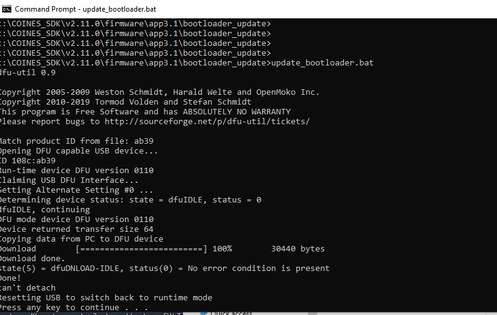

# BME690

BoschSensortec released the BME690 sensor in late 2024, as the next generation of air quality sensors, succeeding the BME680 and BME688.  The BME 690 is claimed to be more robust in high humidity environments, have a lower power consumption, and conform to WELL/RESET standards for IAQ. 

## BME690 Devkit Hardware

The BME690 DevKit became available in early 2025, and uses the Application Board 3.1, 8x BME690 Shuttle Board, and the DevKit software. The Application Board is a general prototyping platform (Arduino) for a range of Bosch Sensortec sensors,using a daughter card called a 'Shuttle Board' for the sensor and a mount on the Application Board 3.1. The interchangeable sensors (shuttle boards) communicate with the Application Board via SPI/I2C and GPIO pins. The Applicaton Board has a Coretex M4 cpu and both internal and external flash storage, with an MTP application preloaded to present the external flash as file system when connected to a PC. 

The application board has a U-Blox NINA-B30 processor (Cortex M4), with bluetooth low energy (BLE, Bluetooth 5) support, a micro-usb (USB2) connection, Stemma/QT connector, and a 2 pin JST connector for a Li-ion battery. In September 2025 the Application board is Version 3.1 and there are two BME 690 Shuttle Boards - a single sensor (S/N 0440.SB4.048) and an eight sensor Shuttle board (S/N 0440.SB9.048).   So this is an ARM Cortex M4F cpu with 1MB  internal flash, 250MB external flash, 256Kb ram, plus the nordic nRF52840 chipset. At the time of writing (Sept 2025) there is no U-Blox NINA B-30 board type in the Arduino IDE, and the BME690 is not supported in the Bosch Development Desktop 4.0.20.  

Above is the Application Board and a shuttle board separated.

Above is the 1x BME690 Shuttle Board mounted on the Application Board.
And below is the 8xBME690 Shuttle Board mounted on the Application Board. Note the Application Board connector is micro-usb (not usb-c).

On its own the 8x BME690 looks like this.
 

The Shuttle Boards have a pin spacing of 1.27mm which is too small for a standard breadboard.

## Software Versions

To get started the following Bosch Sensortec software is required:

| Name                                   | File & Ver                            |
|:---------------------------------------|:--------------------------------------|
| BOSCH Sensortec AI-Studio  Windows     | AI-Studio-Desktop - Version    3.1.0  |
| BOSCH Sensortec COINS_SDK, Windows     | Coines_sdk_2-11_installer_windows.zip |
| BOSCH Sensortec BME690 Development kit | bme690_development_kit v3.1.0         |
| BOSCH Sensortec BSEC Software          | BSEC version  3.2.1.0                 |
| BOSCH Sensortec AI-Studio Mobile App   | Google Play Store (Android only)      |

At the time of writing this is available from [here:](https://www.bosch-sensortec.com/software-tools/software/bme688-and-bme690-software/#Devkitapp) , apart from COINES which is available [here:](https://www.bosch-sensortec.com/software-tools/tools/coines/) 

Much of this software requires agreeing to a licence by form filling, then following a download link sent to your email address. If you have used Bosch Sensortec software before this will be familiar. 

In the BME690 Development Kit the instructions say it requires the download and install of MINGW a Windows version of gcc and ARM cross compilers. The instructions for installing and setting paths are in the Readme.md supplied with the BME690_devkitfw_3.1.0 zip file, however as far as I can see this is only required if you intend to compile the COINS examples .c source, and there is no need to do this to get data collection working. 

My PC already has the silicon labs usb-serial driver installed for the BME688-Devkit which I have left untouched, and the BME690-Devkit is dependent on COINES to  provide the usb to serial driver for the Application Board 3.1. 

## Install

The minimal install steps are:
- AI-Studio for Windows is a zip file download, and is simply unpacked into a directory of your choice. 
- COINS is a zip download with a Windows installer in it. Run the installer, it installs in C:\COINS_SDK, and there is a un-installer in that folder.
- Install the COINS usb driver by running C:\COINS_SDK\v2.11.0\driver\app_board_usb_driver.exe
- BME690 Development Kit is a zip file, and unpacks to a directory of your choice. 
- Reboot the PC

So we now have the minimum to get this working: AI-Studio to create the board config, the COINS usb to uart bridge driver installed to communicate with the Application Board, and the BME690 Development Kit for the data collection sample app. 

Let's connect the Application Board to the PC, by pressing the right most button and then plugging in the USB cable to the PC. This is a little tricky as you have one hand holing the Application Board button and have to push in other end of the cable to the PC USB port.  

If all goes well the application board has one red and one green led lit up, and you can stop pressing the right hand button. The red led is the power led, and the green led shows that the MTP firmware, selected at boot by pressing down the right hand button, has booted and is working.   The MTP firmware is pre-loaded on the Application Board 3.1 and presents the external flash memory as a drive in Windows File manager. (This is where the board config and data are stored.).  The image below shows the COINS bridge driver exe file and how the Application Board 3.1 appears in Windows File manager in MTP Mode.

It took some time to get this to work, it was fussy about the USB cable, and I found looking at device manager it was showing no sign of a virtual comm port. 

When it works in MTP mode (red & Green LED) it looks like this. In Windows File Manager the Flash is reported as 250MB in size, however recorded data is compressed to maximise the space usage. 

And when plugged and powered on with two red LED's it looks like this.

And if it does not look like one of the above then the PC and the Application Board are not talking and that needs fixing before trying anything else. 

Note: MTP is a protocol to support music players, listing tracks, copying files etc, and in my experience it is not robust. You quickly get used to pressing the button and plugging the USB, as it errors quite often.  File manager drag and drop works, but try a couple of files at a time, and note which files you want, rather than copy the  folder - it will fail. 

## Flashing the Demo Sample Application

Plug in the Application Board with the 8x BME690 shuttle, and let it sit with two red lights. 

The demo_sample is in the bin directory of the BME690 Devkit, and it is the data recorder and provides the BLE connectivity to AI Studio Mobile app.

Run Flash.bat, and it should go like this.

Now we need to create a board configuration file in AI Studio Windows, copy that to the Application Board external flash, and power cycle the board to load the sample app with the board configuration. 

First create a new project in AI Studio selecting the 8x BME690 as the target, select the default heater profile and duration and click on the save as at the bottom of the page and save it to file. Scroll down to the bottom of the page to find the button as shown below.

Unplug the Application Board 3.1 from power, hold down the right button and connect the USB to the PC to load the MTP firmware. Use file manager to copy the board config file to the Application Board 3.1 external flash. When that is complete power cycle the Application Board 3.1.

At this point the Application board can be unplugged from the PC and connected to a power bank or LiPO battery, and it will start recording data on connection to a power bank (for LiPO the left hand button acts as on/off), the LED flashes blue as it writes data to the flash storage. Leave it for ~15 min to write out data then pull the power to stop recording and plug it back into the PC with the right button pressed to launch MTP mode. 

Use Windows File Manager to access the Application Board 3.1 Flash storage and copy the data files to your AI Studio project folder. Data is recorded on the Applicaton Board in a compressed format, and needs to be converted on the PC before importing into the AI Studio project. The BME690 Development Kit provides a conversion utility, with a batch script to convert files, but in my experience it only converts one at a time. So copy a label (.labelinfo) and data (.udf) pair to the folder bme690_devkit\tools\converter\data and run the batch file run_me.bat which created a subfolder called "output" to hold the converted label and data files. Copy the output files (.bmelabelinfo and  .bmerawdata) back to the AI Studio project folder, these are files that AI Studi Windows will import.

File handling and management is not great with the BME690 Development Kit, and there is no real time clock so all time stamps are relative to power on. It is important to use session and label info to help you sort out what it is your looking at in AI-Studio Windows, and using AI-Studio Mobile is the answer to managing data recording and testing ai-models. 

## Firmware update
COINES SDK 2.11 comes with updates to the bootloader and MTP applications. You don't have to install these but the latest versions are usually a good idea, and they install as follows:
The boot loader update is in c:\COINS_SDK\v2.11.0\firmware\app3.1\bootloader_update, and it goes like this.

The MTP (file system support) is in c:\COINS_SDK\v2.11.0\firmware\app3.1\mtp_fw_update

MTP is still pretty awful even with the update!

## AI-Studio Mobile

The AI-Studio Mobile app is Android only, and can be found and installed from the Google Play Store. It installs under the name "BME AI Studio" which will help you find it in the sea of other apps.

Using the BME AI Studio app is simple, provided the app is allowed to search and connect to the Application Board 3.1 via bluetooth. If you use Google system tools to add a bluetooth device, like you might a pair of headphones using Settings -> Device Connection ......, it will lead to connection problems in the BME-AI Studio app. Just leave it to the BME AI Studio app to search and connect to the Application Board 3.1 and all will be well. 

Once the App has discovered BMExx Development Kits it lists them, and when the phone is close (BLE is detected) the connect button lights up blue.

The Ai Studio Mobile app has two functions: managing data collection and testing AI Models. In collecting data the appp can create new sessions and label them, and deep dive into raw data from each of the sensors.  

The App is in my view the best way to manage, data recording and labeling, and it lets you see when the sensors have settled down before starting a new recording.

## Testing an AI Model
I have covered generating the AI Model in earlier articles on the BME688 Devkit, and the main change is to be aware of selecting BME688 or BME690 as it defaults to BME688 and you have no data visible as you have just collected BME690 data. And that is a feature: data collected on the BME688 produces AI Models for the BME688 and data from the BME690 produces AI Models for the BME690. There is no interchange of data or models. 

From the AI-Studio Windows algorithm page there is an "Export for BSEC" button, which gives a warning pop-up about the model being for BME690 only, then a screen to choose the BSEC 3 version you wish to target, and finally you can export the model to a storage location of your choice. The .aiconfig and .config files are the ones to copy to the Application Board Flash storage.  To do that power cycle the Application board while holding the right hand button and plugging it into the PC, which brings it up into MTP mode and File Manager can copy and paste the files across.  

Power cycle the Application Board again, but without holding down buttons, which start up the sample application data collection. Now connect the AI Studio Mobile app to the Application Board and click on "Live-test algorithm" which reads the .aiconfig file and starts working as shown below for a classification model. The model shown below is not great (low accuracy ~50%)  and the sensors are not very consistent apart from in clean air.

The AI Studio Mobilie app allows deep dives on each sensor in real time. 

## Compatability with BME688/BME680

So where are we with the BME690, BME688, and BME680?  The BME 690 software stack is built for the BME 690, and AI Studio has a very strict BME688 and BME690 divide that prevents mixing of data between the two family's. If you are using BME688 then BSEC 2  v2.6.1.0  release which is reliable and stable. The BME680 is also supported by the BME68x API and BSEC2, but this is rarely seen these days.  I understand that BSEC2 v2.6.1.0 is the final release (Bosch Sensortec MEMS Sensor Forum), and it is becoming hard to find BME688 Devkits.

 

