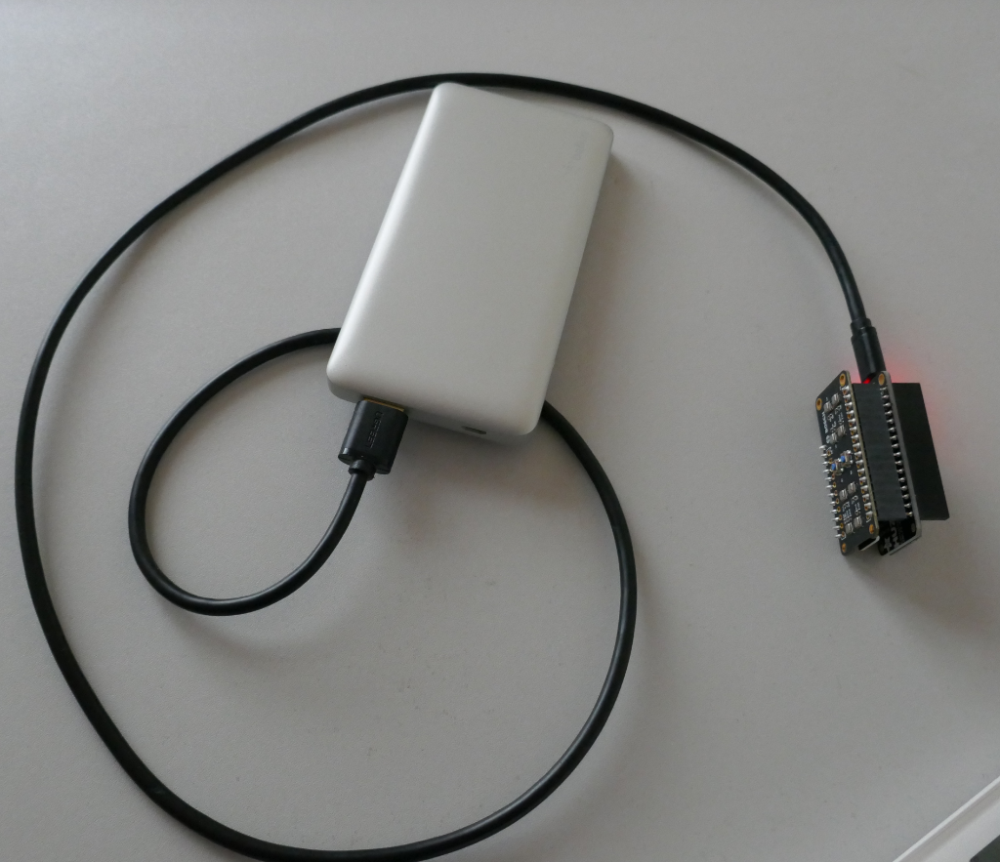
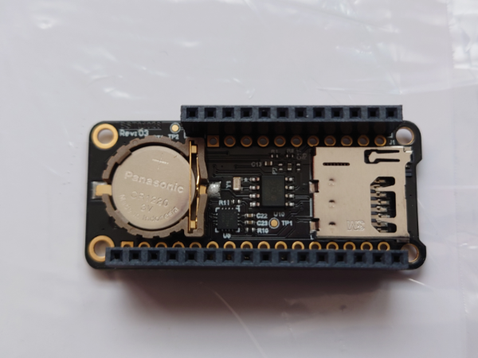
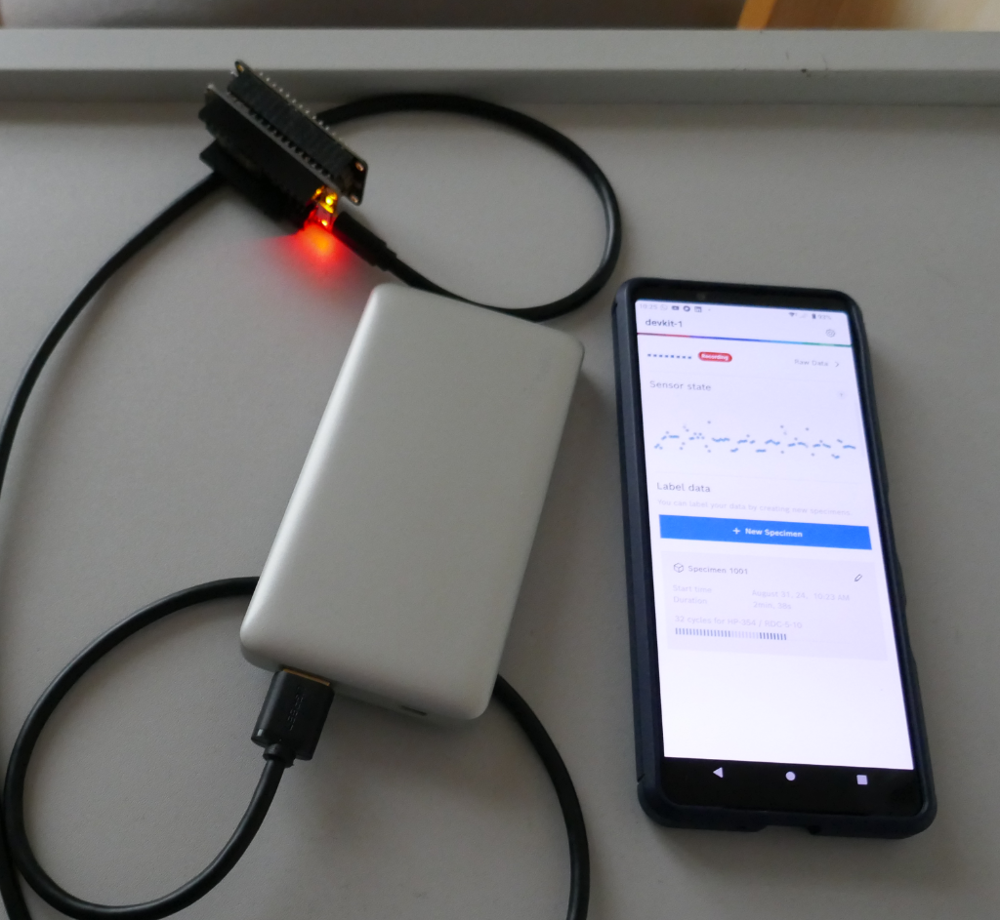
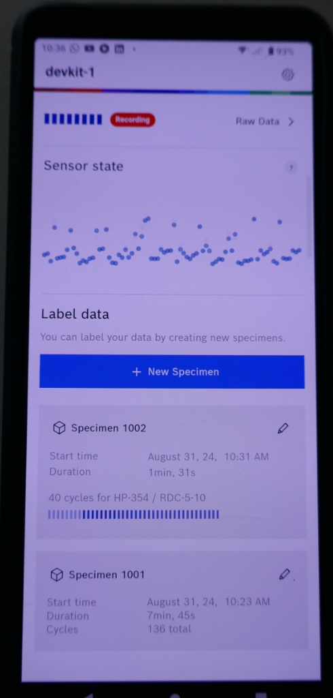
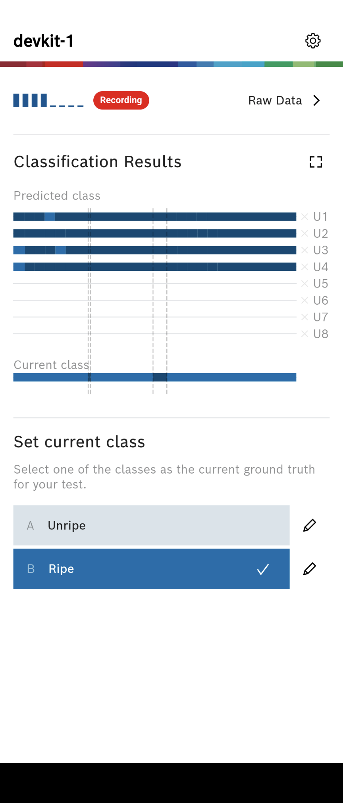
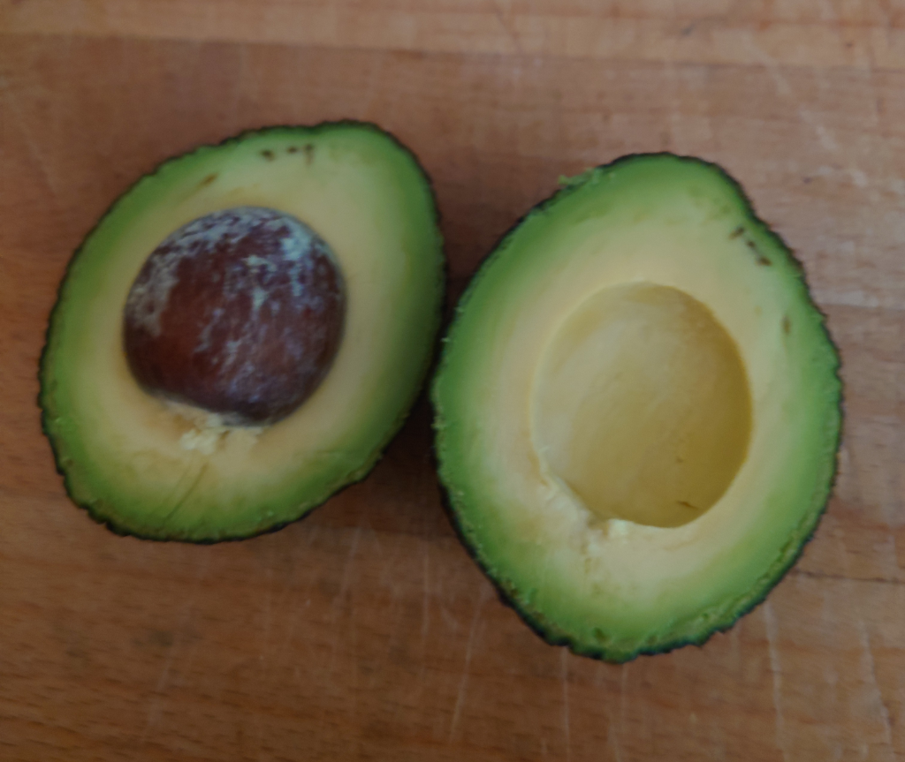
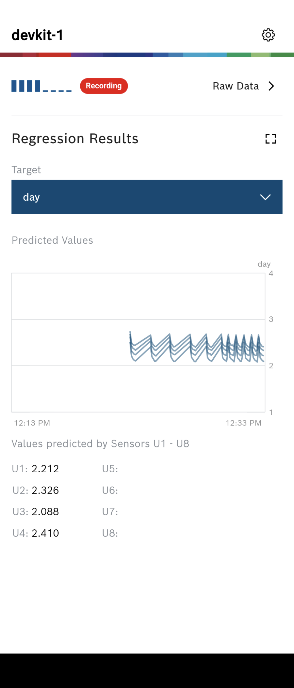
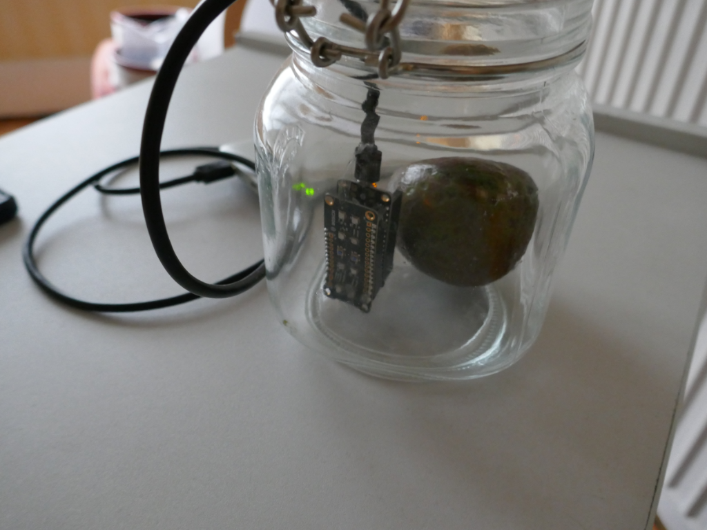

# Teach your Raspberry Pi to Sniff with a BME688 module - Update 2024

This is an update to my May 2023 my article on BoschSensortec AI Studio / BSEC library / DevKit, and how to record data, train an AI Model, and deploy the model to a Raspberry Pi. 

Things that have happened in the BME688 sensor world during the last year are:
- BSEC2 is now at version 2.6-1.0 (July 2024)
- BSEC2 has support for 32bit and 64bit Raspbian (since version 2.5)
- AI Studio Desktop version 2.3.4 was released in July 2024 supporting BSEC2 v 2.6
- AI Studio supports two models: a) regression neural network  b) classification neural network (ADAM)
- The Ai Studio Mobile App (Android apk) verson 2.4.16 was released in Jan 2024 
- The DevKit version 2.1.5 was released in July 2024

The AI Studio Mobile app, connects to the DevKit (Huzza32) via Bluetooth, and sets the RTC clock data and time, which means realistic time stamps on your data. It also supports sample management, graphing raw data in real time, and testing a generated algorithm on 4 of the 8 sensor devkit.

The basics Steps from my 2023 article have not changed, only the software version have altered, however there are new tools and new capabilities which is where our focus will be. 

# Dependencies

I am using the same Bosch Sensortec 8 sensor devkit board (Evaluation Kit Board BME688) and the price is around £29 ex-vat from Mouser, RS, or DigiKey. The Assembled Adafruit HUZZAH32 – ESP32 Feather Board is around £21 inc-vat with Stacking Headers (provides a bit of physical protection but not actually used) from PiHut and others. The coin battery CR1220 and a microSD card complete the kit.  The good news is that in Sept 2024 this is slightly cheaper that a year ago. 

To flash the devkit requires a USB cable, which can also power it. The Huzzah32 supports a battery pack and has a built-in charger (check the Adafruit site for details - it is easy to fry the Huzzah32 with the wrong battery).  I use a power bank (the sort you might buy to top up a phone on the move) with the USB cable, and find it lasts for weeks of recording.

The coin battery (Real Time Clock) and microSD are on the devkit board. Do not pull out the microSD card, it is push in until it clicks and push in and push in again to release.

The 8 BME688 sensors are arranged 4 either side of two blue push buttons, avoid contaminating the sensors (do not touch). 

## AI Studio

The BOSCH Sensortec AI-Studio Desktop version 2.3.4 runs on Windows, and the models (classification or regression) it produces run on BSEC supported processors including the Raspberry PI with a BME688 module. 

The BOSCH-Sensortec software has specific verson requirements, detailed in the release notes and for AI Studio the software set used here is:

| Name                                   | File & Ver                           |
|:---------------------------------------|:-------------------------------------|
| BOSCH Sensortec AI-Studio Mobile       | bme_ai_studio_mobile_app_v2-4-16.apk |
| BOSCH Sensortec BME688 Development kit | devkitfw_v2-1-5_website_release      |
| BOSCH Sensortec BSEC Software          | bsec2-6-1-0_generic_release          |

The BOSCH Sensortec BSEC2 software is not open source, please download the licence terms.
All of the above software can be found [here](https://www.bosch-sensortec.com/software-tools/software/)

The PI3G Python wrapper supporting BSEC 2.6.1.0, on Raspberry PI can be found [here](https://github.com/mcalisterkm/bme68x-python-library-bsec2.6.1.0)

The AI Studio Mobile App is an Adroid package only, and is available from the Google Play Store. It was originally released as a .apk for side loading, but this is no longer required. 

When you start the AI Studio Mobile app it needs to find and connect by Bloetooth to the devkit, so you need to be close, as shown above.  Do not set up the blootooth connection in Adroid Settings  -> Device Connection, as this will confuse the app and will lead to hours of frustration. Let the app manage bluetooth searching/connecting to devkits and all will be good.

When the app connects, it resets the devkit interrupting any active recording. Click on the Blue New Session box to create a new recording, no need to fat finger the tiny blue buttons on the devkit.

As data is recorded the number of cycles is shown, and in the raw-data screen it will graph the collected data. 

Once you have data and have generated a model, copy .aiconfig and .config to the devkit microSD card.  Power up the devkit and connect the mobile app to it, selecting the option to test a model which reads the configs and starts to scan. 

In the image above is using a classification model for unripe (rock hard) and ripe (ready to eat) avocado. I selected "ripe" as the base and al 4 sensors are in agreement that this is not a ripe avocado. 

Unfortunately the model is not very good, and the avocado was eaten for lunch. For the first few minutes 2 sensors agreed on ripe and 2 sensors on unripe, but they settled quite quickly on all giving the unripe answer which was wrong. The training results only expect 73% accuracy (26% false positive)

AI Studio Desktop also has the ability to generate regression models, so I added metadata tags to my data samples labeling each with the day I collected the data - Day=1 Day=2, ....Day=5. In the hope that a regression model could discriminate the day 3/4 which were the ready to eat days. I started out with 4 avocados. 

AI Studio Desktop was unhappy with the "Data Balance", basically uneven sample numbers, but it did generate a model. And with the model .aiconfig and .config copied the the microSD card as before here we are in the mobile app.

The regression model returns a single value of where in the metadata rage it thinks it is sniffing. The 4 sensors in use all estimate a little over 2 days (from the Day 1 to Day 5 data), and they are wrong as they are sniffing a Day 5 avocado.

The regression model provides a prediction histogram with the training results, and that shows a random walk all over the place and not the ideal tight distribution centered around zero

So again in this case the model is not good.

I have been gathering data by placing an Avocado in a kilner jar and recording for approx 30 min, then taking the avocado out of the jar. Repeat once each day. The hypothesis being that Ethylene production would increase until at a peak the fruit is ripe, and then it would decline. 

The data gathered unfortunately all looks very similar.

Why did I think this could be modelled.....

Avocados ripen in an Ethylene gas that is self synthesized by the Avocado, regulated by ABA (abscisic acid) hormones, and when stressed by de-hydration start to degrade.  Avocados typically have a high respiration rate and a limited shelf life. Temperature is a factor in how active the systesis is (cold is slower, hot is generally faster), with no significant difference between the 'Hass' and 'Fuerte' types of Avocado. Its reported that when Avocado  are exposed to ethylene for 24-48 hours, it induces ripening to occurring in 3-4 days.

Avocado produces high amounts of ethylene (80–100 μl kg−1 h−1 at 20°C) at the climacteric peak (Seymour and Tucker, 1993). Ethylene and abscisic acid become important for fruit maturation since they tightly control fruit ripening in climacteric fruit.  Full softening of the fruit happend 2-3 days after the climacteric peak (ethlyene) 

So what went wrong.....
I bought the avocados on the same day, but that does not mean they were the same age or the same softness.  Avocados are tested by a mechanical tool applying fixed pressure and measuring the deflection. I needed to have that information to go with the devkit data collection, as a baseline calibration. Not having a baseline means that I just had random data, and the AI model did not make much sense of it. I had assumed that Age in days would be good enough but the assumption they were all the same age/softness to start with was not valid. It's always the assumptions that get you!

