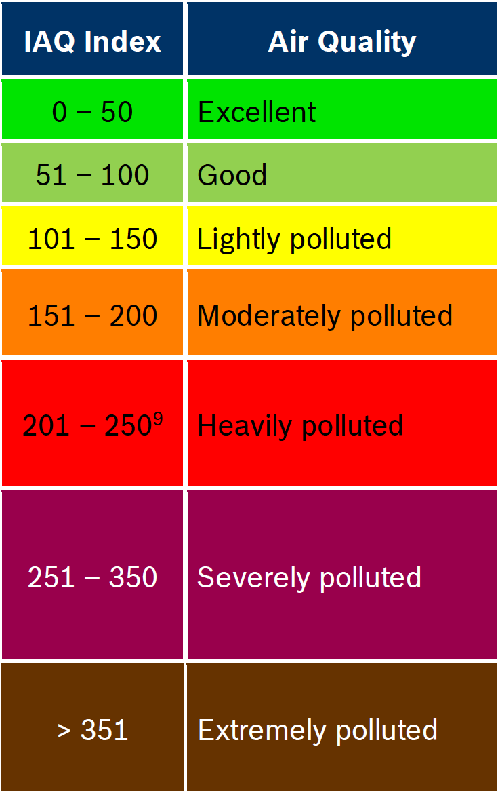

# MOX Sensors -BME6XX

MOX or MOS sensors use a metal-oxide sensing surface, a heater, and a chip to measure changes in conductivity. The gas in contact with the metal-oxide plate has oxygen molecules absorbed, changing the conductance of the plate to the current across the plate. Low cost MOX sensors based on microhotplates fabricated with [MEMS][1] (micro-electro-mechanical Systems) technology dominate the market. However, there are many different nanosized metal oxides and carbon nano-materials that offer different properties for specific applications aiming to meet the need for portable high-throughput systems that are fast and sensitive. Our focus is on Gas detection and measuring air quality, which are two different things: the gas detector might be designed to measure CO2 ppm, and Air Quality is measuring IAQ (Indoor Air Quality) and particulate size.  IAQ measurement is closely related to measuring TVOC (Total Volotile Organic Compounds)

## Air Quality Sensors - TVOC
The term “VOC” doesn’t refer to a specific substance, it covers a range of substances with similar properties. [VOCs][2] (Volatile Organic Compounds) are a group of substances that have a boiling point under 250 Centigrade, that is they vapourise at temperatures below 250 C. 

Other terms you may see are: VVOC (Very Volatile Organic Compounds) these boil at lower temperatures below 50 C. VOC is also a generic term which includes VOCs and VVOCs. And SVCs (Semi Volatile Organic Compounds) which have higher boiling points. 

Some examples:
- VVOC    Propane, Butane
- VOC     Ethanol, Tolulene
- SVOC    Pestacides and Fire retardents

See Ref 2 for a larger list, but note there are thousands of substances that have chemical properties of a VOC.  Many of these are common in housholds: cleaning products, solvents, coatings, adhesives, etc.

As there are so many VOCs, monitoring all of them continuously is too hard/expensive. This leads to the use of VOC profiles, and the TVOC concept created to measure the overall level of VOCs in a given space. And the need for a baseline of substances used in TVOC measurement gave rise to standards such as: 

ISO 16000-29:2014 Indoor air
Part 29: Test methods for VOC detectors

Bosch Sensortec produces a range of Air Quality [gas sensors][4]: BME680, BME688 and BME690.

Bosch Sensortec follow the ISO 16000-29 process, and provided details of their target gasses and the VOC profile used (breath-VOC) in the "Data Sheet" for the sensor. The [BME690][3] is the latest generation at the time of writing, and the testing quoted is for H2S (Hydrogen sulfide), EtOH (ethanol) CO (carbon monoxide) and b-VOCs (breath-VOCs).

| Molar fraction	 | Compound	              | Production tolerance	 | Certified accuracy  |
|:----------------|:-----------------------|:----------------------|:--------------------|
| 5 ppm           | 	Ethane                | 	20%                  | 	5%                 |
| 10 ppm          | 	Isopropene/2-methyl-1 | 	20%                  | 	5%                 |
| 10 ppm          | 	Ethanol               | 	20%                  | 	5%                 |
| 50 ppm          | 	Acetone               | 	20%                  | 	5%                 |
| 15 ppm          | 	Carbon Monoxide       | 	10%                  | 	2%                 |

According to the data sheet, the above b-VOC profile is used in generating the data for calibrating the BSEC IAQ algorithm.   BSEC also outputs estimates for CO2 equivalent (ppm), and b-VOC equivalent (ppm) that are scaled from the static IAQ and based on the b-VOC profile above.  The TVOC value is stated as being derived from ethanol lab tests, so again is an estimate/derived value. There are two IAQ values: static IAQ (sIAQ) and IAQ, the difference is that IAQ is scaled using an auto-trimming algorithm and sIAQ is not scaled. The scaling/auto-trimming is time-based and depends on the config you apply (4 day or 28 day) and scales IAQ 50 and 250 to the best and worst gas values it sees over that time period. So it scales the data to fit the graph between 50 and 250). sIAQ is said to be best used for fixed location sensors and IAQ for mobile sensors (where the scaling based on recent sensor history - 4 or 28 days) helps adaption to changing conditions).

## Selective Gas Sensors

The MOX family of sensors were developed as low cost TVOC sensors as covered above, and whilst they are sensitive, they are not typically selective to specific compounds/substances.  However, there has been some success in applying AI to improve selectivity from MOX sensor data, see the paper by Kingston University [Air Pollution Monitoring Using Cost-Effective Devices Enhanced by Machine Learning][5] and earlier work on [calibration methods] [6]

The known issues with MOX sensor selectivity include:
- Cross-sensitivity: a lab model is generated in a controlled environment, however, in the wild other compounds may be present that cross-react impacting your results. This is a known issue for MOX sensors and a sensor calibrated in one environment may be way out in another, given the lack of selectivity in this family of sensors.
- Inconsistency between sensors: Bosch state +-15% sensor to sensor deviation as normal. inconsistency applies to MOX sensors as a family. 
- Durability: MOX sensors tend to drift over their lifetime, and suffer drift at high and low concentrations. They also suffer from physical contamination such as deposition of fats or silicones on the sensor or its casing. In the case of the BME6XX touching the metal case will leave oils from your skin which will gas out as the device heats, impacting measurements.  Where there is heavy contamination such as cooking oil, high humidity, etc, then protecting the sensor with a film/gauze will be necessary. 
- Humidity, temperature, and pressure (Height above sea level): All of these things impact sensor readings. For example, the sensor may be mounted on a board next to a power supply, a hot location that will impact the sensor temperature readings. If the sensor heater is on a rapid duty-cycle, it may well heat the area around it distorting temperature readings. Humidity is known to impact MOX sensor performance. And assumptions of atmospheric pressure may not be true. Pressure sensitivity is usually good so you can measure movements up and down from pressure variation, but absolute values need a baseline and what we often have is an assumption.   
  
Developments and improvements in MOX sensors may remove some of these issues, and the application of low complexity machine learning models has demonstrated an ability to deliver performance improvements [5]. 

## Calibration
We have seen (from the community forum) that Bosch Sensortec does not release data from its testing beyond that listed in the data sheet for the device. This testing uses expensive environmental chambers and lab equipment, which your company may have, or you may have access to at a University, but probably not accessible for DIY users.  If all you want to know is are things getting better or worse, then relative values (increasing/decreasing) will support this. But if you want to compare your results with external data, then calibration is essential. 

### Temp, Humidity, Pressure
METAR/TAF (Meteorological Aerodrome Reports, Terminal Area Forecasts) stations are associated with Airports and provide comprehensive data you can use to calibrate temp, pressure, humidity. (Assuming you have one close by).  In the UK the MetOffice DataPoint API provides access to historic data and forecasts (you have to sign up to get an API key). Also local councils may have air quality monitoring in your area. 
 
You might also use more than one sensor, such as the DHT22 temperature and humidity sensor, which is cheap, reliable, and accurate (+-0.5 C).

### Calibration Gasses
Calibration Gasses are alloy canisters (non-refillable) issued with a certificate of analysis (ISO6141) and used with a flow regulator and a piece of tubing, to provide a calibrated gas mixture to test sensors.  Nitrogen is often used as the carrier gas: Oxygen in Nitrogen, Hydrogen Sulphide in Nitrogen, Carbon Monoxide and Oxygen in Nitrogen, etc. [Air Products][9] have a standard range of available calibration gasses, and there are many suppliers of similar products. 

## Gas Analysers

There are several options and DEFRA [Technical Guidance (TG22): Local Air Quality Management] [7] gives a good overview of how to get started monitoring air quality and what works best for measuring common pollutants.

Common options:
- Gas Chromatogaphy is highly accurate, but involves sample collection and sending to a lab for analysis. Something that might be done on a two weekly cycle sending batches of samples for analysis.
- Optical Analysers use the interaction of light and gaseous species to detect and measure specific gas concentrations. Absorption spectroscopy sensors (laser light) are typically used in continuous flue gas monitoring (NO, NO2, NH3, SO2) in an industrial context (MCERTS Certified products). Typically, multiple probes connect to a CAN-Bus or Modbus network where the data is collected by a processor/analyser.  Quenched florescence (QF) analysers measure oxygen levels in a gas stream. Chemiluminescence sensors use a reaction cell with a sample of gas flowing through the sensor, and the light emitted is measured by a photodetector. They are used in NO2, NO, and NOx monitoring. The issues with optical sensors are lens obstruction from dust, soot, or moisture, and regular calibration testing is usually required.
- Passive Diffusion Tubes rely on the diffusion to pass the air and its contaminant molecules past the reagent in the tube. Tubes are made for a specific gas and will have a standard measurement range (for example 1 hour at 1013 hpa, 20 C). Results are read directly off the scale printed on the tube, and represent an average for the period. There can be bias in PDS placed in urban environments and 10% - 20% are [reported] [8], and their use is [discussed in] [7]. Due to their low cost and easy deployment (strap to a lamppost), diffusion tubes are often deployed throughout an area to gain a spatial view of concentrations in "hot spots".

##  Use of AI to improve MOX selectivity
MOX sensors are low cost compared to all the above gas analysis methods, but as we have seen, they are sensitive but not selective.  To improve the selectivity, a number of [studies][5] have turned to AI, and have found that results vary across the range of target elements due to gas cross sensitities, and the impact of temperature, pressure and humidity. 

The Bosch Sensortec BME688 and BME690 work with AI Studio to build models which can be used to "sniff" up to 4 separate classes. Data is collected using an 8 sensor devkit, which is loaded into the AI Studio. A starting point is to collect 30 minutes of data for each element you are trying to model (for example, banana, apple, pear, normal air), to try to have a balanced number of data points (similar size of data for each class). The AI Studio produces models using either an ADAM (a gradient descent optimiser) model or regression method. If all goes well, AI Studio will produce a model with estimates of the error rates expected (model quality).  Deploying the model in 'selectivity' (scanning) mode on the BME688 or BME690 sensor returns a percentage result for each of the (max) 4 classes. So Class 1 banana might be 70%, Class 2 apple 15%, Class 3 Pear 5%, and Class 4 Normal Air 30%). 

References

[1]: https://www.electronicshub.org/mems-sensors/

[2]: https://www.epa.gov/indoor-air-quality-iaq/technical-overview-volatile-organic-compounds

[3]: https://www.bosch-sensortec.com/media/boschsensortec/downloads/datasheets/bst-bme690-ds001-00.pdf

[4]: https://www.bosch-sensortec.com/products/environmental-sensors/gas-sensors/

[5]: https://www.mdpi.com/1424-8220/25/5/1423

[6]: https://www.sciencedirect.com/science/article/abs/pii/S1352231019304194

[7]: https://laqm.defra.gov.uk/wp-content/uploads/2022/08/LAQM-TG22-August-22-v1.0.pdf

[8]: https://www.rsc.org/images/environmental-brief-no-8-2015_tcm18-244603.pdf
[9]: https://www.airproducts.co.uk/gases/calibration-mixtures
