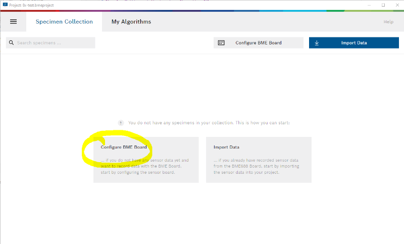
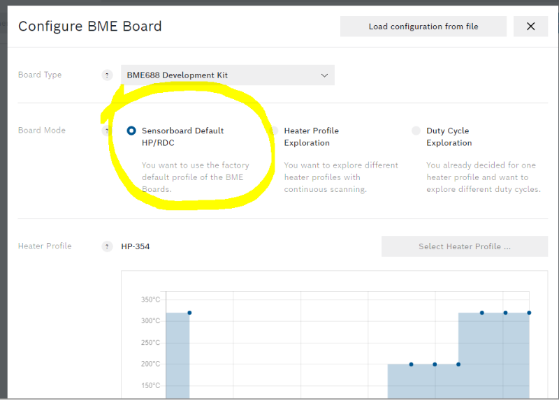
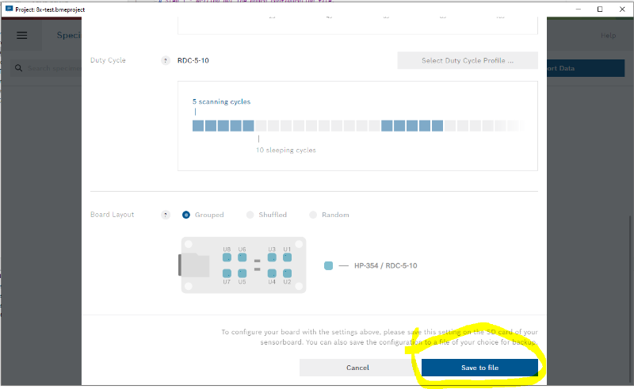
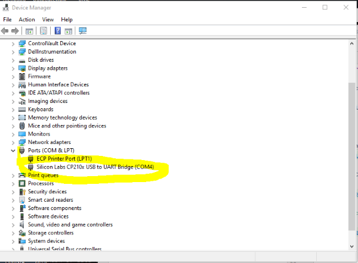
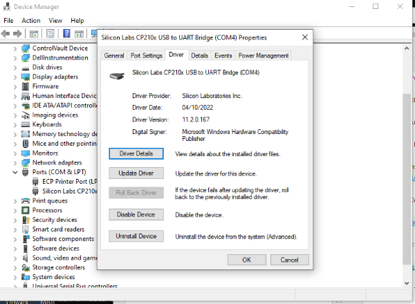
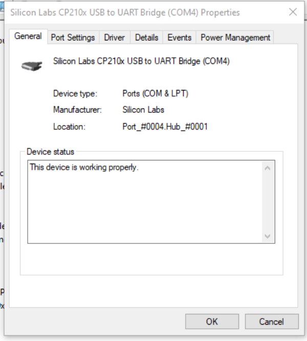
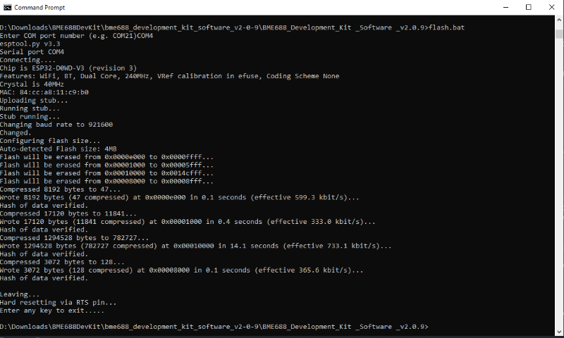
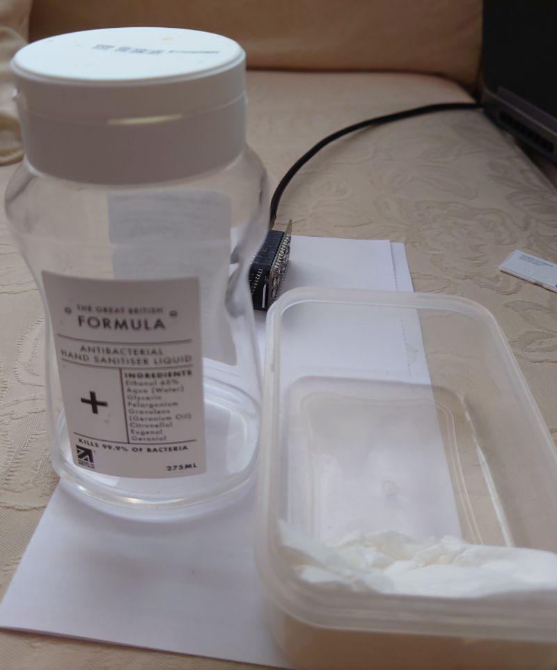

# Teach your Raspberry Pi to Sniff with a BME688 module

In this article we cover the recording of data, training the AI Model, and deploying the model to a Raspberry Pi Zero 2.
There are three 
# Dependencies

For data collection I purchased the Bosch Sensortec 8 sensor devkit board from Mouser (mouser.co.uk, part no 262-EVALBD-BME688, price ex-vat £30.69), which is the bare board and requires the separate purchase of an Adafruit Huzzah ESP 32. The 8 sensor devkit board needs a coin battery CR1220 and a microSD card (up to 32GB is supported, the socket is spring-loaded so push in to release).


The 8 BME688 sensors are arranged 4 either side of two blue push buttons.


The HUZZA32 is an ESP32 Arduino board with WiFi and Bluetooth (WROOM).


A USB cable with Micro-USB at the devkit bord, is required to connect to your workstation (which will most likely be USB Type A or Type C).


The BOSCH Sensortec AI-Studio runs on Windows and MAC, and the models it produces run on BSEC supported processors including the Raspberry PI (32 bit). The BME688 single sensor breakout modules communicate using I2C, and are produced by several makers including PI3G, Adafruit, Pimoroni, SparkFun. I use my BME688 breakout modules with Raspberry PI Zero 2 boards, as shown [here.](https://github.com/mcalisterkm/p-sensors/tree/master/src/1.3.0)

NOTE: It is important not to touch the BME688 sensor as it may contaminate the sensor and introduce measurement errors. The two push buttons in the middle are used to mark changes in data, and it is easy to miss.
  
The BOSCH-Sensortec software have release notes describing what versions are compatible, and the software set used here is:

| Name                                   | File & Ver                                |
|:----------------------------------------|:------------------------------------------|
| BOSCH Sensortec AI-Studio  Desktop     | AI-Studio - Version 2.0.0                 |
| BOSCH Sensortec BME688 Development kit | bme688_development_kit_software_v2-0-9   |
| BOSCH Sensortec BSEC Software          | BSEC version 2.4.0.0                      |

The BOSCH Sensortec software is not open source, please see the licence terms.
All of the above software can be found [here](https://www.bosch-sensortec.com/software-tools/software/bme688-software/)

The PI3G Python wrapper supporting BSEC 2.4.0.0, on Raspberry PI can be found [here](https://github.com/mcalisterkm/bme68x-python-library-bsec2.4.0.0)

# Step 1 - Create and write out the board configuration file in Bosch AI-Studio.
1. Start Bosch AI Studio

The first thing it will ask is for you to create a project, so you need to know (or create a suitable folder) where you will save the files and data that you will be creating.

2. Click the Hamburger in the top left corner and check the version.

The BOSCH Sensortec versions are all different so BSEC and AI-Studio version numbers are not the same, the release notes for AI-Studio say what versions of BSEC it supports. It matters as many important data files include a header with the version of BSEC used to produce them.


3. Click on Configure BME Board



    And select default configuration.



4. Write out the config to the same place as your project.



6. Copy to microSD card

Mount the microSD card you are using with the BME Devkit on your computer (mine has an SD-CARD slot) and use a file manager to copy the board file into the root of the SD-CARD (FAT format and no bigger than 32GB).  The file name will be similar to this: 2023_05_03_12_54_BoardConfiguration.bmeconfig. My computer has an adapter for the microSD.

7. Eject the SD-CARD and put it back in the BME688-Devkit


# STEP 2 - BME688-Devkit setup
8. Communicating with the BME6888-Devkit
The devkit connects to your computer via a USB cable, and it requires serial communications to be enabled and that requires a driver to be loaded.
Windows 10 recognises the devkit on plugging the USB cable in, but by default does not have the driver, so looking in device manager you will see similar to this.



Open the silicon labs device and the driver may not be present (unless you have already loded it)



The driver is downloaded from SiliconLabs and Adafruit provide a link here:
(https://learn.adafruit.com/adafruit-huzzah32-esp32-feather/using-with-arduino-ide)

The download is CP210x_Universal_Windows_Driver.zip, which is unzipped and installed from the screen shown above.
The port installed is COM4 as indicated in the screen below (Location: Port_0004).



9. Flash the Adafruit Huzzah ESP32 feather.

The development kit software unzips to create a folder named: bme688_development_kit_software_v2-0-9
Open a CMD window in this folder and run flash.bat.
It will ask for the COM port and install the BOSCH Sensortec firmware on the Huzza32.



The Huzza32 has two LED either side of the microUSB connection, one red and one yellow. The yellow is external lithium battery charge information, and as I have no external battery it flashes constantly. The red flashes intermittently prior to flashing the firmware, and after flashing it emits a steady 1 sec flash when recording. Recording starts as soon as the development kit is powered on.  The coin battery supports the RTC (real time clock) only.


Now the development kit sensors need to be left powered on for 24 hours to burn in. Introducing the sensor to "bad" air in this burn in is a good idea and below you can see I have some hand sanitiser 65% Ethenol and a tissue. Wet the tissue (moist not runing wet) with a few drops of sanitiser and use a container to cover the sensors with the tissue pushed in the end not in contact with the sensors.



After the burn in period, unplug the development kit from USB and remove the microSD card. Mount the microSD on a computer and have a look to make sure files are being written. This is what my microSD card looked like.


# STEP 3 - Recording Data & Import into AI-Studio

Once the development kit is powered on it will start recording (assuming you flashed it in Step 2), and display the regular 1 sec red LED flash. 
The power to the micro USB could come from a power bank (phone charger battery), a computer, or a Lithium cell. It is easiest to leave the usb cable plugged into your computer, but all it is doing is providing power to the development kit

The buttons on the development kit provide a label marker in the data file, so you can note when you start and end a recording with a smell. Pressing buttons adds to label info files and the data collected includes identifiers, but it has no idea what smell changes are being made, so you still need to make notes of times, actions, and the buttons pressed. 

In folder 8x-test.bmeproject/data there are two bmerawdata files providing data from single recording sessions of indoor room air, and ethenol (hand sanitiser). Start AI-Studio and open the folder 8x-test.bmeproject as the project, and it should look like this.


For Air I used Button 1 and 2 as start and stop so ignore the small amount of data recorded as Initial and the Button 2, the sample of interest is labelled Button 1. For Ethanol I pressed button 2 during the data collection to see what it would do, and as a result both Button 1 and Button 2 samples are needed for Ethanol. 

Note: The data time/date stamps are way out and I have not yet found a way to set the RTC on the development-kit.

To add more data choose the Import Button, and to view the data click on Settings (by each session) and the Ethanol data looks like this.


# STEP 4 - Generating a model

To generate a model in AI-Studio click on "My Algorithms", and see that two classes have been created using the data as described above.


The data checks out against the tests in AI-Studio, and the button to "Train Neural Net" is active


Click on the "Training Results" tab to see the successful results, and the button to export the model as BSEC Config file.
The model is exported in 8x-test.bmeproject/model which looks like this.


The file we need for the Raspberry PI (PI3G BSEC Python wrapper) is: 2023_05_06_15_00_Air-Ethanol_HP-354_RDC-5-10.config


# Step 5 - Sniffing with a PI Zero 

This is the PI3G sensor which has a longer 'nose' than most sensor modules. Note the advice printed on the nose: 'Do not touch the sensor'.


Assuming that PI3G/BME-68xPython-library with support for BSEC 2.4.0.0 is installed and working, then the two files required are sniff.py and 2023_05_06_15_00_Air-Ethanol_HP-354_RDC-5-10.config. With these files transferred to the PI run as follows

```
$ python3 sniff.py
```

And here is a pimoroni BME688 sniffing the air.


And BSEC is 100% certain that it is sniffing air.


Now we add the tissue with some hand sanitiser (ethanol 68%)


And BSEC agrees it is Ethanol but not always 100%.


But if we slide the damp tissue further away from the sensor, BSEC starts to get confused. 


And I think that's because I only collected data on a strong smelling source placed close to the development kit sensors, and now I am diluting the smell by moving the tissue further away and the model fails. 
MOX sensors like the BME688 sample the atmosphere they are given and not any specific component of that atmosphere. So for example training on a specific pure gas is unlikely to find traces of that gas in an open atmosphere. I would need to train in a realistic environment that I expect the sensor to recognise, and if that is multiple scenarios then I need data from each one to train the algorithm.  AI-Studio also suggests varying the heater profiles if results are not good enough, and tuning the duty cycle after the algorithm is chosen to adjust the power consumption.  


